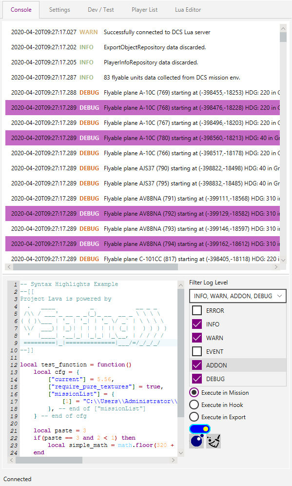
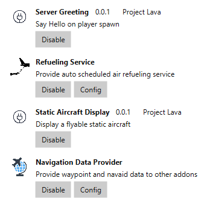
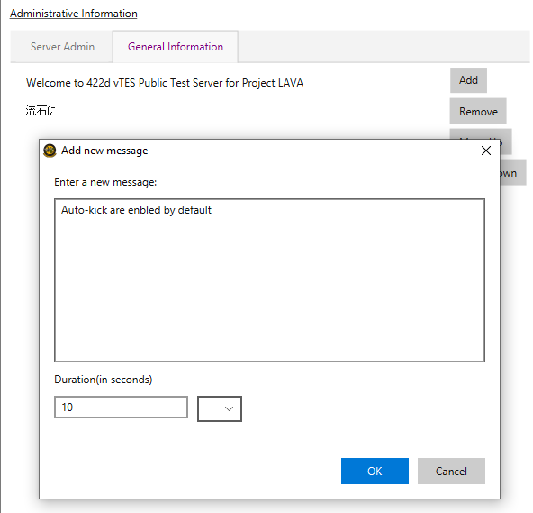
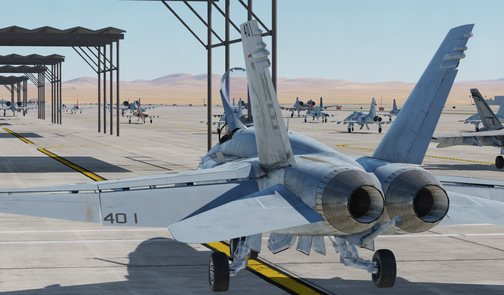
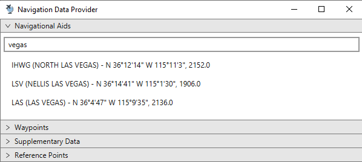
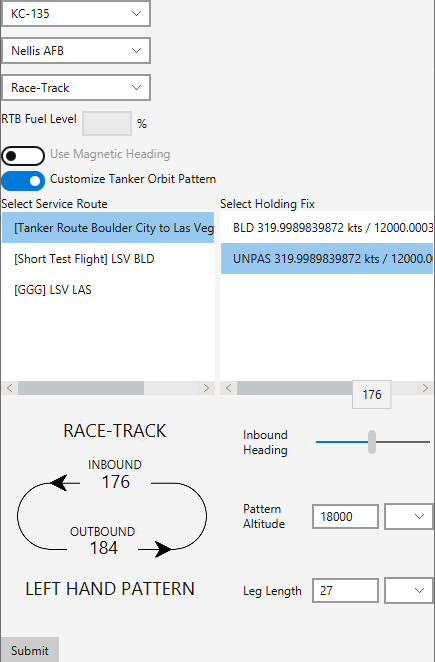
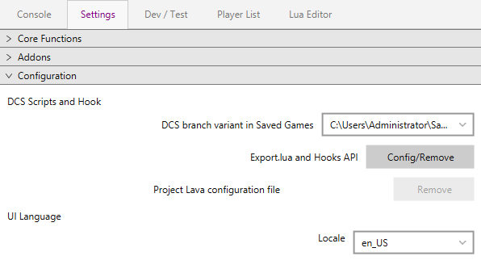
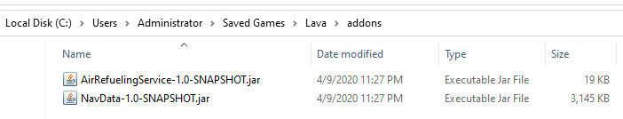

# Project Lava
An functional framework for DCS World and a solution to mission scripting, server management and data analysis, packed with a GUI control panel.

 {:height="50%" width="50%"}

Project Lava enables average users or server hosts to control and extends the functionality of DCS World server without the need to write scripts. Project Lava is designed with compatibility in mind: it is supposed to be used, without the necessity to modified existing mission, and compatible with any map theatres, missions or DCS lua scripts such as MIST / Moose Framework or external tools such as SimpleRadioStandalone and TacView.

# Ok, show me some examples

Automatically sends administrative info or greets player on spawning.

Each flyable aircraft has a static model displayed at the position it will be spawned at. If a player enters this aircraft, the static model is removed before player spawns. If a player leaves this aircraft, the static model is re-added to the apron before player de-spawns.

A navigational data provider that can be used to provide real-world aeronautical chart data, such as Navaid or Waypoint position.

A tanker service dispatcher that can dispatch tanker automatically based on tanker type, route, service info

# Pros and Cons
\- Guess what, it’s written in Java, and it uses Spring. Java is …complicated, so is Spring Framework. You need to know both to be able to write a plugin / define your own DCS behaviors.

 

\+ What Lava can achieve depends on whatever plugin you want it to load.

\+ Plugins are easy to install and loosely coupled. If something is wrong, you just disable or remove the plugin.

\+ While Lua scripts can potentially cause server instability if not handled correctly, you don’t need to worry about it if you are using Project Lava.

\+ Use Lava together with existing scripts in a hybrid way.

\+ GUI opens up for more potential customizations.

\+ No longer need to embed each script to every single mission you will ever make. See? You can have several tankers ready on station without having to add a tanker group in Mission Editor by hand, every time.

\+ You can do web things with plugin, because Spring is a full stack framework, for example, display data using a webserver.

# How does it work?
Project Lava, along with several other prototype projects, has been made to tackle a very specific problem in DCS online multi-player environment: heavy Lua tasks slow down server performance and responsiveness and induce stuttering. Tons of Lua scripts are injected at runtime to extend playability, thus increasing the Lua CPU usage for each “frame”, where the speed, 3d position, animations and behaviors of all objects in the simulation are processed and calculated. After all of these are done, user scripts are executed before the next frame is rendered.
Maybe you want to send a message to a group, or maybe you need to spawn a tanker because the previous one is rammed or shotdown by someone, or, you want to iterate through a pile of units and find a specific unit or a set of units that are controlled by AI, has "AAA" in their name, are air defense units with radar turned off. These "common" behaviors are usually written in Lua script and included in each mission; you either do loops to lookup or check for a data or condition, or you put existing names from Mission Editor to a table, and use the name to access certain unit table; that is how DCS is supposed to work, and that is as much expendable as it can be, without pulling runtime data out of the sim environment.

It makes scripts heavily coupled with the mission it was designed for. Or you have to make a choice, be slowed or be coupled.

The solution is straight forward: minimize the amount of Lua CPU time spent on user scripts.
Or simply put: Less script, better performance. Don’t script inside DCS.

What Project Lava provides is a Java based backend application that obtains data from a  Lua server hooked on DCS callbacks, and thus it can provide APIs and SPIs for a pluggable behaviors besides what core Project Lava can provide.

DCS will load Lava script and create a Lua server that can process requests received over local network. These requests may include unit data extraction, or executing a certain command, sending a message to the player, deleting certain units, or restarting the server. If data is requested, coroutine is used to “split” data, so that excessive data of potentially thousands of units in the sim will not slow down or block next DCS frame from rendering, if data requested is too large to be processed in a single frame. If a request is to perform some action, DCS can just do it, without “thinking” about it too much.
When a request is completed, asynchronously, Lua server sends some data back to Lava, where raw data can be organized, processed and then saved into database so that it can be directly accessed through the user interface. Thanks to some “Spring Magic”, this application can be used with third party addons/plugins to expend its functionality, or it can be used along as a Lua environment explorer. The GUI provides a Lua Editor that can highlight syntax for the user, and can send the content through TCP connection as JSON RPC to the hooked Lua Server and immediately get a result in either mission, server or export environment.

#How to install

You will need to have a Java Runtime Environment (JRE) in order to run Project Lava.

If you'd like to load Project Lava with plugins, you can create an `addons` directory under `%USERPROFILE%\Saved Games\Lava\`(if you have run Lava at least once, it will create a config directory for you just besides your DCS write paths) and run with below JVM options, where Spring Boot loader searches *.jar files from Project Lava config directory and loads classes into classpath:

`java -cp "backend-gui-0.0.1-SNAPSHOT.jar" -Dloader.path="%USERPROFILE%\Saved Games\Lava\addons" -Dloader.main=moe.ofs.backend.BackendApplication org.springframework.boot.loader.PropertiesLauncher`

At current stage, Lava uses Hypersonic2 (H2) in-memory database to manage sim runtime data from DCS. Following the initial release, an option will be available to allow user to connect to local database and persist the current mission state of the mission.

Some of the ideas for Project Lava are borrowed from other DCS project such as DCS-Witchcraft, and some of the prototype projects had been made during the years to exercise this idea; in the end, Java / Spring is chosen to be what Project Lava will be written in because of its complexity and the possibility of DCS moving to unix platforms after it adopts new Vulkan API.

If you have the intention to produce addons for Project Lava, you can check docs and example provided in backend-plugin module in the core project. Also check https://github.com/Kaidrick/Lava-NavData and https://github.com/Kaidrick/Lava-AirRefuelingService for examples.

